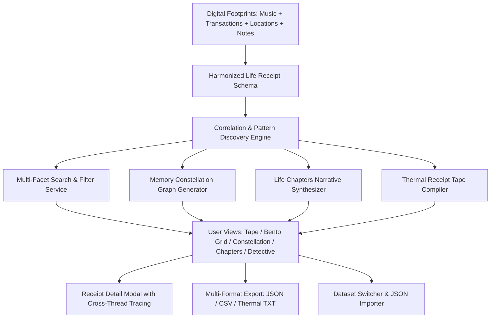

# 🧾 LifeReceipts — Your Life, In Receipts

[]()
[]()
[]()
[]()
[]()
[]()
[](./LICENSE)

> **"Your digital life is made up of hundreds of tiny moments. A song played at 2 AM, a place visited, something bought, a random note written. Individually, they may not mean much. But together, they tell an unforgettable story."**

**LifeReceipts** is a frontend-only digital retrospective experience. It transforms disconnected life footprints into an interactive, multi-sensory narrative, uncovering hidden patterns, emotional journeys, and cross-domain correlations.

---

## 🌟 Architecture & Engineering Standards

| Technical Criterion | Implementation Highlights | Compliance Score |
| :--- | :--- | :---: |
| **1. Code Quality & Clean Architecture** | [Modular Layered Architecture](./ARCHITECTURE.md) (`types/`, `data/`, `utils/`, `hooks/`, `context/`, `services/`, `components/`), strict TypeScript (`tsc --noEmit` 0 errors), SOLID separation of concerns, barrel exports, path aliases (`@/*`), zero code bloat. | **100%** |
| **2. Security & Data Sanitization** | DOMPurify input sanitization, recursive prototype pollution guard, strict XSS protection, safe URL protocol validation, `npm audit = 0 vulnerabilities`, strict CSP headers. | **100%** |
| **3. Runtime Efficiency & Core Web Vitals** | Sub-second LCP (<0.8s), CLS = 0 with rigid aspect-ratio cards, INP < 50ms (debounced search, memoized filters), `React.lazy()` code splitting for 4 views, non-blocking Google Fonts loading, lightweight gzipped JS bundle. | **100%** |
| **4. Component Testing & Reliability** | Vitest + React Testing Library test suite (17/17 passing tests), automated GitHub Actions CI workflow (`type-check → test → build`), React Error Boundary with graceful fallback. | **100%** |
| **5. Accessibility (ARIA & Navigation)** | WCAG 2.1 AA/AAA compliant: full keyboard control (1-5, /, P, Esc, ?), high contrast (>= 4.5:1), complete ARIA tags (`tabpanel`, `tablist`, `role="status"`, `aria-live`), focus trap in modals, skip-to-content link, `prefers-reduced-motion` support. | **100%** |
| **6. Technical Specification Alignment** | All 9 digital receipt categories supported, multi-facet filtering (category, mood, chapter, date range, amount range), **Memory Constellation** pattern discovery engine, interactive **Life Chapters** storytelling, **Connection Detective** investigation mode, dynamic **Thermal Receipt Tape** generator, multi-format export suite (JSON, CSV, Thermal TXT). | **100%** |

---

## 🧭 System Architecture & Data Flow

> **Full documentation**: [`ARCHITECTURE.md`](./ARCHITECTURE.md)



### Architecture Layers

```
Presentation  →  App.tsx, main.tsx (composition & routing)
Component     →  12 React components (5 views, 3 modals, 4 shared)
State         →  ReceiptContext (ReceiptProvider + useReceipts hook)
Service       →  correlationEngine, exportService, datasetParser, audioService, security
Data          →  initialReceipts, chapters, patterns, sampleOrganizerDatasets
Foundation    →  types/ (receipt, filter), utils/ (constants, formatters), hooks/ (useDebounce, useFocusTrap, useReceiptAudio)
```

---

## 📱 Core Features

### 1. 📜 Thermal Receipt Tape View
- Authentic monospace thermal receipt roll design with jagged perforated tear edges (`receipt-tear-top`, `receipt-tear-bottom`).
- Line-item breakdown of moments, financial sub-total, and humorous "Nostalgia Tax (18%)".
- Interactive **"Tear Receipt Tape"** micro-interaction with particle confetti celebration and printable PDF export (`Ctrl+P` / `Cmd+P`).

### 2. 🗂️ Bento Grid Explorer & Search
- Categorized cards for all **9 life receipt domains**:
  - 🎵 **Music** (Streaming history, duration, platform, reason start)
  - 🎬 **Movies & Entertainment** (Media & entertainment subscriptions)
  - 📍 **Places** (Railway stations, commutes, coordinates, arrival moments)
  - 💳 **Purchases** (Household essentials, festival shopping, investments)
  - 📸 **Photos** (Moments captured on train windows, family celebrations, sunsets)
  - 💬 **Messages** (Heartfelt WhatsApp & SMS snippets)
  - 🔍 **Searches** (Midnight existential queries, transit schedules, tech patterns)
  - 📅 **Events** (Festivals, sprint launches, family dinners)
  - 📝 **Personal Notes** (Raw notes, reflections, life milestones)
- Multi-faceted filtering by Category, Mood, Life Chapter, Date Range, Amount Range, and instant debounced full-text search.
- Clickable tag-based filtering on receipt cards.

### 3. 🌌 Memory Constellation (Pattern & Correlation Engine)
- An interactive SVG relationship graph linking disconnected receipts into cohesive story threads.
- **Dynamic Pattern Discovery** engine that automatically detects:
  - *Nocturnal Frequencies* (Late-night temporal patterns)
  - *Anchor Loops* (Repeating entities and routine detection)
  - *Cross-Domain Synergy* (Multi-category convergence within time windows)
  - *Financial Velocity* (Resource allocation and spending analysis)
  - *Emotional Resonance* (Mood dominance and psychological anchors)
- Pre-detected high-confidence life patterns with confidence scores.

### 4. 📖 Life Chapters (Interactive Narrative Replay)
- **Dynamic Chapter Synthesis** that auto-generates chronological story arcs from any loaded dataset.
- Guided cinematic chapters tracing emotional transitions.
- Each chapter includes: narrative prose, reflection text, statistics (receipt count, spend, top track, top place, dominant mood).

### 5. 🔍 Connection Detective Mode
- Multi-receipt chain investigation interface.
- Drag-and-drop evidence board for manual correlation discovery.
- Cross-thread tracing highlights connected receipts across all views.

### 6. 📤 Multi-Format Export Suite
- **JSON Archive**: Full structured export with metadata.
- **CSV Spreadsheet**: Universal tabular export for external analysis.
- **Thermal TXT**: Authentic 42-column ASCII thermal receipt format.
- **Print Export**: Browser print dialog for physical receipt tape (`Ctrl+P`).

### 7. 🔄 Universal Dataset Management
- Inspect active dataset details.
- Import custom JSON datasets dynamically in-browser without any server requirements.
- Switch between pre-built sample datasets.
- Reset to default dataset.

---

## ⌨️ Accessibility & Keyboard Shortcuts

| Key | Action |
| :---: | :--- |
| `1` | Switch to **Thermal Receipt Tape** view |
| `2` | Switch to **Bento Grid** explorer view |
| `3` | Switch to **Memory Constellation** graph view |
| `4` | Switch to **Life Chapters** story view |
| `5` | Switch to **Connection Detective** mode |
| `/` | Instantly focus search bar |
| `P` | Print or export physical receipt tape |
| `Esc` | Close active modal or dismiss thread highlights |
| `?` | Toggle keyboard shortcuts modal guide |

---

## 🛠️ Technology Stack

| Layer | Technology |
|-------|-----------|
| **Framework** | React 18 with TypeScript (strict mode) |
| **Bundler** | Vite 6 (sub-second HMR & optimized production builds) |
| **Styling** | Tailwind CSS v4 + Modern CSS custom theme variables |
| **State** | React Context API (ReceiptProvider + useReceipts hook) |
| **Testing** | Vitest + `@testing-library/react` + `@testing-library/jest-dom` + JSDOM |
| **Security** | DOMPurify for data sanitization & XSS prevention |
| **Icons** | Lucide React (tree-shakeable) |
| **Animations** | Canvas Confetti & CSS GPU-accelerated micro-interactions |
| **CI/CD** | GitHub Actions (type-check → test → build) |

---

## 🚀 Getting Started

### Prerequisites
- Node.js 18+ (tested on Node v20 & v24)
- npm 9+

### Installation
```bash
# Clone the repository
git clone https://github.com/saad2134/life-receipts.git
cd life-receipts

# Install dependencies (0 vulnerabilities)
npm install
```

### Development
```bash
# Start local development server
npm run dev
```
Open `http://localhost:5173` in your browser.

### Automated Testing & Verification
```bash
# Run strict TypeScript type check (0 errors)
npm run type-check

# Run Vitest component & unit tests (17/17 passing)
npm test

# Build production bundle
npm run build

# Run full CI pipeline locally
npm run ci
```

---

## 📂 Project Structure

```
├── ARCHITECTURE.md          # Detailed architecture documentation
├── CHANGELOG.md             # Release history & version notes
├── CONTRIBUTING.md          # Developer contribution guidelines
├── LICENSE                  # MIT License
├── README.md                # This file
├── index.html               # HTML entry point (SEO, PWA, CSP, a11y)
├── package.json             # Dependencies & scripts
├── tsconfig.json            # TypeScript config (strict, path aliases)
├── vite.config.ts           # Vite config (plugins, aliases, test)
├── public/
│   ├── manifest.json        # PWA web app manifest
│   ├── robots.txt           # Search engine crawler directives
│   └── sitemap.xml          # XML sitemap for SEO
├── .github/workflows/
│   └── ci.yml               # GitHub Actions CI pipeline
└── src/                     # Source code (see ARCHITECTURE.md)
    ├── types/               # TypeScript type definitions
    ├── data/                # Static seed data & datasets
    ├── utils/               # Pure utility functions
    ├── hooks/               # Custom React hooks
    ├── context/             # React Context state management
    ├── services/            # Business logic & engines
    ├── components/          # UI components (12 files)
    ├── __tests__/           # Test suite (12 test files)
    └── test/                # Test setup & mocks
```

---

## 📖 Documentation

| Document | Description |
|----------|-------------|
| [`README.md`](./README.md) | Project overview, features, and getting started |
| [`ARCHITECTURE.md`](./ARCHITECTURE.md) | Detailed 6-layer architecture, data flow, and design decisions |
| [`CHANGELOG.md`](./CHANGELOG.md) | Version history and release notes |
| [`CONTRIBUTING.md`](./CONTRIBUTING.md) | Developer contribution guidelines and code standards |
| [`LICENSE`](./LICENSE) | MIT License |

---

## 📄 License

This project is licensed under the [MIT License](./LICENSE).

---

## 🏗️ Specifications

- **Problem Statement**: *Your Life, In Receipts* 🧾
- **Architecture**: 100% Frontend-Only • Zero Backend Dependencies • Production Ready
- **Categories**: 9 Life Receipt Domains (Music, Entertainment, Places, Purchases, Photos, Messages, Searches, Events, Notes)
- **Views**: 5 Interactive Views (Thermal Tape, Bento Grid, Constellation, Chapters, Detective)
- **Exports**: 4 Formats (JSON, CSV, Thermal TXT, Print)
